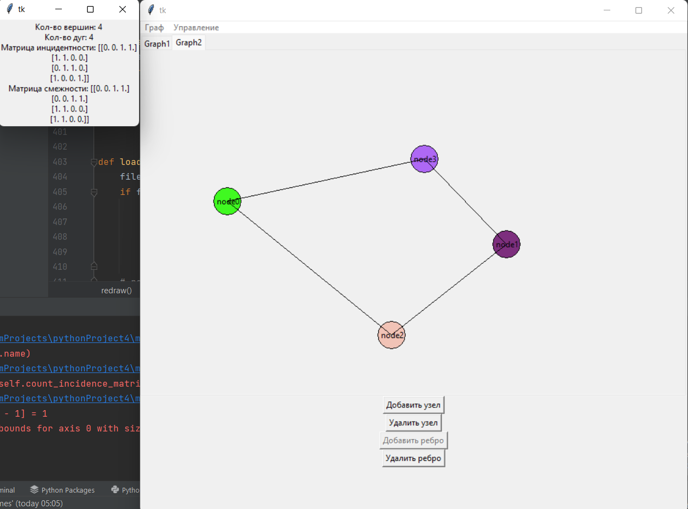
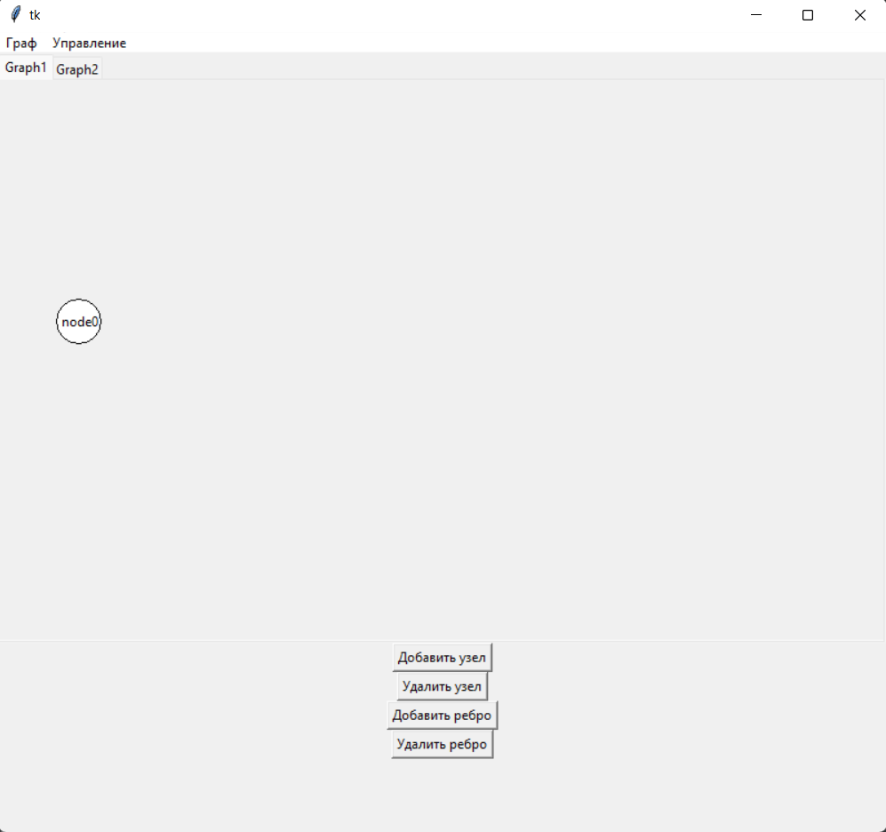
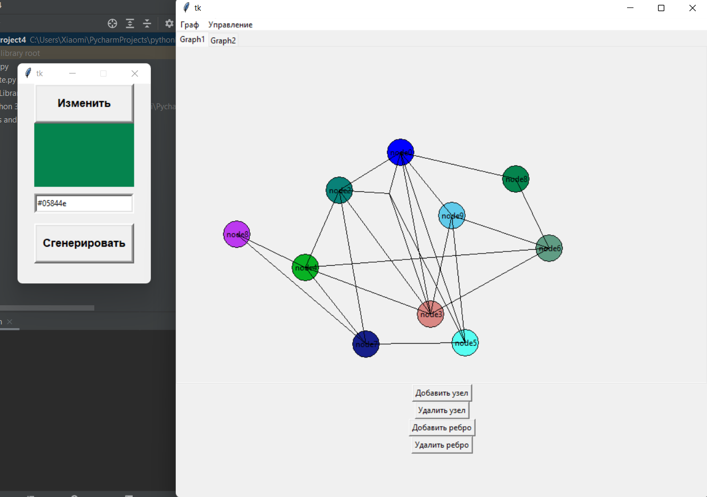

Министерство образования Республики Беларусь <br/>
Учреждение образования <br/>
«Брестский государственный технический университет» <br/>
Кафедра ИИТ <br/>

Лабораторная работа №3 <br/>
За третий семестр <br/>
По дисциплине: «Общая теория интеллектуальных систем» <br/>
Тема: «Разработка программного продукта для работы с графовыми конструкциями» <br/>

Выполнил: <br/>
Студент 2 курса <br/>
Группы ИИ-22 <br/>
Сидоренко А.А. <br/>

Проверил: <br/>
Иванюк Д.С. <br/>

Брест 2022 <br/>

# Общее задание #
1. Разработать и реализовать программный продукт позволяющий
редактировать графовые конструкции различных видов и производить над
ними различные действия. Язык программирования - любой.

2. Редактор должен позволять (задания со **[\*]** являются необязательными):  
  a) одновременно работать с несколькими графами (MDI);  
  b) **[\*]** выделение одновременно нескольких элементов графа, копирование
выделенного фрагмента в clipboard и восстановление из него;  
  c) задавать имена графам;  
  d) сохранять и восстанавливать граф во внутреннем формате программы;  
  e) экспортировать и импортировать граф в текстовый формат (описание
см. ниже);  
  f) создавать, удалять, именовать, переименовывать, перемещать узлы;  
  g) создавать ориентированные и неориентированные дуги, удалять дуги;  
  h) добавлять, удалять и редактировать содержимое узла (содержимое в
виде текста и ссылки на файл);  
  i) задавать цвет дуги и узла, образ узла;  
  j) **[\*]** создавать и отображать петли;  
  k) **[\*]** создавать и отображать кратные дуги.

3. Программный продукт должен позволять выполнять следующие операции:  
  a) выводить информацию о графе:

 + количество вершин, дуг;
 + степени для всех вершин и для выбранной вершины;
 + матрицу инцидентности;
 + матрицу смежности;
 + является ли он деревом, полным, связанным, эйлеровым, **[\*]** планарным;

  b) поиск всех путей (маршрутов) между двумя узлами и кратчайших;  
  c) вычисление расстояния между двумя узлами;  
  d) вычисление диаметра, радиуса, центра графа;  
  e) **[\*]** вычисление векторного и декартово произведения двух графов;  
  f) **[\*]** раскраска графа;  
  g) нахождения эйлеровых, [*] гамильтоновых циклов;  
  h) **[\*]** поиск подграфа в графе, со всеми или некоторыми неизвестными
узлами;  
  i) **[\*]** поиск узла по содержимому;  
  j) **[\*]** объединение, пересечение, сочетание и дополнение графов;  
  k) **[\*]** приведение произвольного графа к определенному типу с
минимальными изменениями:

 + бинарное и обычное дерево;
 + полный граф;
 + планарный граф;
 + связанный граф;

4. Формат текстового представления графа:
<ГРАФ> ::= <ИМЯ ГРАФА> : UNORIENT | ORIENT ; <ОПИСАНИЕ УЗЛОВ> ;
<ОПИСАНИЕ СВЯЗЕЙ> .
<ИМЯ ГРАФА> ::= <ИДЕНТИФИКАТОР>
<ОПИСАНИЕ УЗЛОВ> ::= <ИМЯ УЗЛА> [ , <ИМЯ УЗЛА> …]
<ИМЯ УЗЛА> ::= <ИДЕНТИФИКАТОР>
<ОПИСАНИЕ СВЯЗЕЙ> ::= <ИМЯ УЗЛА> -> <ИМЯ УЗЛА> [ , <ИМЯ УЗЛА> …] ;
[<ОПИСАНИЕ СВЯЗЕЙ> …]

5. Написать отчет по выполненной лабораторной работе в .md формате (readme.md). Разместить его в следующем каталоге: **trunk\ii0xxyy\task_03\doc** (где **xx** - номер группы, **yy** - номер студента, например **ii02102**). 

6. Исходный код разработанной программы разместить в каталоге: **trunk\ii0xxyy\task_03\src**.

## Язык Python ##


``` python
import pickle
import random
import threading
import tkinter
import tkinter.ttk
from collections import deque
from heapq import heapify, heappop, heappush
import colour as clr
import random as rnd
from tkinter import filedialog
import json
import pygubu as pg

import networkx as nx
from tkinter import *
import numpy as np
import matplotlib.pyplot as plt


class Arc:
    i = 0
    color = clr.Color("Black")

    def __init__(self, name, color, graph, is_oriented):
        Arc.i += 1
        self.id = self.i
        self.name = name
        self.color = color
        self.graph = graph
        self.shape = Canvas
        self.text = Canvas
        self.start_node = Node
        self.finish_node = Node

        self.is_oriented = is_oriented
        self.x_s = None
        self.y_s = None
        self.x_f = None
        self.y_f = None

    def __dict__(self):
        return {
            'id': self.id,
            'name': self.name,
            'start_node': self.start_node,
            'finish_node': self.finish_node,
        }


class Node:
    i = 0
    stnd_color = clr.Color("White")
    radius = 20
    x = 10
    y = 100

    def __init__(self, name, color, graph, x, y):
        Node.i += 1
        self.id = self.i
        self.name = name
        self.color = color
        self.graph = graph
        self.arcs = []
        self.x = x
        self.y = y
        self.shape = Canvas
        self.text = Canvas

    def add_arc(self, arc):
        self.arcs.append(arc)

    def get_arcs(self):
        return self.arcs

    def is_has_arc(self, arc):
        if arc in self.arcs:
            return True
        else:
            return False

    def set_color(self, color):
        self.color = color

    def set_name(self, name):
        self.name = name

    def __dict__(self):
        return {
            'id': self.id,
            'name': self.name,
            'arcs': self.arcs,
            'x': self.x,
            'y': self.y
        }


class Graph:
    def __init__(self, name):
        self.name = name
        self.nodes = []
        self.arcs = []
        self.d = {'': []}
        self.oval = None
        self.text = None
        self.canvases = []

    def __str__(self):
        return f"Кол-во вершин: {len(self.nodes)}\n" \
               f"Кол-во дуг: {len(self.arcs)}\n" \
               f"Матрица инцидентности: {self.count_incidence_matrix()}\n" \
               f"Матрица смежности: {self.count_adjacency_matrix()}"

    def add_node(self, node):
        self.nodes.append(node)

    def add_arc(self, arc):
        self.arcs.append(arc)

    def count_incidence_matrix(self):
        matrix = np.zeros((len(self.nodes), len(self.arcs)))
        for node in self.nodes:
            for arc in self.arcs:
                if node.is_has_arc(arc):
                    matrix[node.id - 1][arc.id - 1] = 1
        return matrix

    def count_adjacency_matrix(self):
        self.d.clear()
        matrix = np.zeros((len(self.nodes), len(self.nodes)))
        for node in self.nodes:
            arr = []
            for arc in self.arcs:
                if node.is_has_arc(arc):
                    if node == arc.start_node:
                        arr.append(arc.finish_node.name)
                        matrix[node.id - 1][arc.finish_node.id - 1] = 1
                    else:
                        arr.append(arc.start_node.name)
                        matrix[node.id - 1][arc.start_node.id - 1] = 1
            self.d[node.name] = arr
        return matrix

    def breadth_first_search(self, start, end):
        queue = deque([start])
        visited = []
        while queue:
            point = queue.popleft()
            if point not in visited:
                visited.append(point)
                if point == end:
                    return visited
                queue.extend(self.d[point])
        return []

    def dijkstra(self, start, end):
        distances = {node: float('inf') for node in self.d}
        distances[start] = 0
        queue = [(0, start)]
        heapify(queue)
        while queue:
            distance, node = heappop(queue)
            if node == end:
                return distance
            if distance == distances[node]:
                for neighbor, cost in self.d[node].items():
                    new_distance = distance + cost
                    if new_distance < distances[neighbor]:
                        distances[neighbor] = new_distance
                        heappush(queue, (new_distance, neighbor))
        return float('inf')

    def remove_node(self, node):
        self.nodes.remove(node)

    def remove_arc(self, arc):
        self.arcs.remove(arc)

    def to_dict(self):
        return {'nodes': self.nodes, 'arcs': self.arcs}


class Window(Tk):
    btn_add_arc = Button
    t1 = threading.Thread
    t2 = threading.Thread
    current_graph = Graph("")
    current_node = Node
    current_canvas = Canvas
    current_arc = Arc
    notebook = None
    graph_1 = None
    graph_2 = None
    canvas1 = None
    canvas2 = Canvas
    isArcActivate = False

    def __init__(self):
        super().__init__()
        # self.canvas1 = Canvas(self.tab_1)
        # self.node2 = self.canvas1.create_oval(5, 5, 75, 75, fill=clr.Color("Red"))
        # self.canvas2 = Canvas(self.tab_2)
        # self.canvas1.pack(fill=tkinter.BOTH, expand=1)
        # self.canvas2.pack(fill=tkinter.BOTH, expand=1)
        # Событие на переключение между графами

        # self.current_canvas.tag_bind(self.node2, "<ButtonRelease-1>", self.on_node_release)
        # self.current_canvas.tag_bind(self.node2, "<ButtonPress-1>", self.on_node_press)
        # self.current_canvas.tag_bind(self.node2, "<B1-Motion>", self.on_node_motion)

        self.mainloop()

    def set_notebook(self, notebook):
        self.notebook = notebook


# Bind event handlers to the nodes
def create_nodes_fnc(node):
    def start(e):
        global x_prev
        global y_prev
        x_prev = e.x
        y_prev = e.y

    def drag(event):
        x = event.x - x_prev
        y = event.y - y_prev
        node.x = node.x + x
        node.y = node.y + y
        Window.current_canvas.move(node.text, x, y)
        Window.current_canvas.move(node.shape, x, y)
        redraw()

    def choose(event):
        Window.btn_add_arc.config(state=ACTIVE)
        Window.current_node = node
        redraw()

    def set_arc(event):
        node.add_arc(Window.current_arc)
        Window.current_arc.finish_node = node
        redraw()

    Window.current_canvas.tag_bind(node.shape, "<ButtonPress-1>", start)
    Window.current_canvas.tag_bind(node.shape, "<Double-Button-1>", choose)
    Window.current_canvas.tag_bind(node.text, "<Double-Button-1>", choose)

    Window.current_canvas.tag_bind(node.shape, "<Button-3>", set_arc)
    Window.current_canvas.tag_bind(node.text, "<Button-3>", set_arc)
    Window.current_canvas.tag_bind(node.text, "<ButtonPress-1>", start)
    Window.current_canvas.tag_bind(node.text, "<ButtonRelease-1>", drag)
    Window.current_canvas.tag_bind(node.shape, "<ButtonRelease-1>", drag)


class Plt:
    entry_color = Entry
    label_color = Label
    color = clr


def generate_color():
    Plt.entry_color.delete(0, END)
    color = '#{:02x}{:02x}{:02x}'.format(*map(lambda x: random.randint(0, 255), range(3)))
    Plt.label_color['bg'] = color
    Plt.entry_color.insert(0, color)
    Plt.color = color


def change_clr():
    window = Tk()
    window.geometry('200x300')
    window.resizable(0, 0)
    Plt.label_color = Label(window, bg='white')
    Plt.label_color.place(relx=0.5, rely=0.3, anchor=CENTER, width=150, height=130)
    Plt.entry_color = Entry(window, borderwidth=4)
    Plt.entry_color.place(relx=0.5, rely=0.6, anchor=CENTER, width=150, height=30)
    btn_generate_clr = Button(window, text="Сгенерировать", font='Arial 13 bold', borderwidth=4, command=generate_color)
    btn_generate_clr.place(relx=0.5, rely=0.8, anchor=CENTER, width=150, height=60)
    btn_commit = Button(window, text="Изменить", font='Arial 13 bold', borderwidth=4, command=commit_clr)
    btn_commit.place(relx=0.5, rely=0.10, anchor=CENTER, width=150, height=60)
    window.mainloop()


def commit_clr():
    Window.current_node.set_color(Plt.color)


class Name(Tk):
    name = Tk
    text = Entry()


def change_name():
    Window.current_node.set_name(Name.text.get())
    redraw()


def window_cng_name():
    name = Tk()
    name.geometry('200x300')
    name.resizable(0, 0)
    Label(name, text="Название").grid(row=0)
    Name.text = Entry(name)
    Name.text.grid(row=0, column=1)
    Button(name, text='Изменить', command=change_name).grid(row=3, column=1, sticky=W, pady=4)
    name.mainloop()


def on_add_node():
    node = Node(f'node{len(Window.current_graph.nodes)}', Node.stnd_color, Window.current_graph, rnd.uniform(0, 800),
                rnd.uniform(0, 500))
    Window.current_graph.add_node(node)
    redraw()
    create_nodes_fnc(node)


def on_add_arc():
    arc = Arc(f'arc{len(Window.current_graph.arcs)}', clr.Color("Black"), Window.current_graph, False)
    Window.current_graph.add_arc(arc)
    Window.current_arc = arc
    Window.current_node.add_arc(arc)
    arc.start_node = Window.current_node
    Window.btn_add_arc.config(state=tkinter.DISABLED)


def on_tab_changed(event):
    Window.current_graph = Window.graph_1 if Window.notebook.index(Window.notebook.select()) == 0 else Window.graph_2
    Window.current_canvas = Window.canvas1 if Window.notebook.index(Window.notebook.select()) == 0 else Window.canvas2
    Node.i = len(Window.current_graph.nodes)
    Arc.i = len(Window.current_graph.arcs)
    redraw()


def on_remove_node():
    try:
        Window.current_graph.remove_node(Window.current_node)
        redraw()
    except Exception:
        print("not choose node to delete")
    Node.i = len(Window.current_graph.nodes)
    a = 1
    for node in Window.current_graph.nodes:
        node.id = a
        a += 1


def on_remove_arc():
    Window.current_graph.remove_arc(Window.current_arc)
    Window.current_arc = Window.current_graph.arcs[len(Window.current_graph.arcs) - 1]
    Arc.i = len(Window.current_graph.arcs)
    a = 1
    for arc in Window.current_graph.arcs:
        arc.id = a
        a += 1

    redraw()


def redraw():
    print(Node.i)
    print(Window.current_graph.nodes)
    print(Window.current_graph.arcs)
    Window.current_canvas.delete('all')
    clr_n = None
    for node in Window.current_graph.nodes:
        if Window.current_node != node:
            clr_n = node.color
        else:
            clr_n = clr.Color("Blue")
        x, y = node.x, node.y
        r = node.radius
        node.shape = Window.current_canvas.create_oval(x - r, y - r, x + r, y + r, fill=clr_n)
        node.text = Window.current_canvas.create_text(x + 1, y, text=node.name)
        create_nodes_fnc(node)
        try:
            for arc in Window.current_graph.arcs:
                if arc.start_node != arc.finish_node:
                    arc.shape = Window.current_canvas.create_line(arc.start_node.x, arc.start_node.y, arc.finish_node.x,
                                                                  arc.finish_node.y, fill=arc.color)
        except Exception:
            print("Arc not found")
    # self.canvas2.delete('all')
    # self.draw(self.current_canvas)


def print_info():
    window = Tk()
    print(Window.current_graph.name)
    label = Label(window, text=f'{Window.current_graph.__str__()}')
    label.pack()

    window.mainloop()


def save_file():
    file = tkinter.filedialog.asksaveasfilename(filetypes=[("Graph files", ".graph"), ("TXT Graph", ".txt")])
    with open(file, 'wb') as f:
        # Сериализация
        pickle.dump(Window.current_graph.nodes, f)
        pickle.dump(Window.current_graph.arcs, f)


def load_file():
    file = tkinter.filedialog.askopenfilename()
    if file:
        # Чтение данных из файла
        with open(file, 'r') as f:
            data = f.read()
        obj2 = json.loads(data)
        print(obj2)
    # redraw()


def main():
    # создаем окно программы
    window = Tk()

    width = window.winfo_screenwidth()
    height = window.winfo_screenheight()
    width = width // 2  # середина экрана
    height = height // 2
    width = width - 400  # смещение от середины
    height = height - 400
    window.geometry('800x700+{}+{}'.format(width, height))
    window.resizable = False

    # создаем меню программы
    menu = Menu(window)
    window.config(menu=menu)
    # создаем пункт меню "Файл"
    file_menu = Menu(menu)
    # создаем пункт меню "Граф"
    graph_menu = Menu(menu)
    # создаем пункт меню управления вершинами и ребрами
    control_menu = Menu(menu)
    # создаем подменю пункта "Файл"
    # file_menu.add_command(label='Открыть', command=load_file)
    # file_menu.add_command(label='Сохранить', command=save_file)
    # file_menu.add_command(label='Сохранить в текст. варианте')
    # menu.add_cascade(label="Файл", menu=file_menu)
    # создаем подменю пункта "Граф"
    graph_menu.add_command(label='Вывести информацию', command=print_info)
    menu.add_cascade(label="Граф", menu=graph_menu)

    control_menu.add_command(label="Изменить цвет", command=change_clr)
    control_menu.add_command(label='Изменить имя', command=window_cng_name)
    menu.add_cascade(label="Управление", menu=control_menu)
    # создаем MDI для графов
    notebook = tkinter.ttk.Notebook(window)
    notebook.bind('<<NotebookTabChanged>>', on_tab_changed)
    tab_1 = Frame(notebook)
    tab_2 = Frame(notebook)
    graph_1 = Graph('Graph1')
    Window.graph_1 = graph_1
    graph_2 = Graph('Graph2')
    Window.graph_2 = graph_2
    notebook.add(tab_1, text='Graph1')
    notebook.add(tab_2, text='Graph2')
    notebook.pack()
    Window.notebook = notebook

    # Создаем холст для вершин и графов
    canvas = Canvas(tab_1, width=800, height=500)
    canvas2 = Canvas(tab_2, width=800, height=500)
    Window.canvas1 = canvas
    canvas.pack()
    canvas2.pack()
    Window.canvas2 = canvas2
    # Создаем кнопки для создания и удаления вершин
    add_node_button = Button(window, text='Добавить узел', command=on_add_node)
    add_node_button.pack()

    remove_node_button = Button(window, text='Удалить узел', command=on_remove_node)
    remove_node_button.pack()
    add_arc_button = Button(window, text='Добавить ребро', command=on_add_arc)
    add_arc_button.config(state=DISABLED)
    add_arc_button.pack()
    Window.btn_add_arc = add_arc_button
    remove_arc_button = Button(window, text='Удалить ребро', command=on_remove_arc)
    remove_arc_button.pack()

    # Draw two nodes

    window.mainloop()

    # Define event handlers for dragging the nodes


if __name__ == '__main__':
    main()

```

##Работа с несколькими графами(MDI) 

Можно работать одновременно с 2-мя графами, переключаясь между холстами

##Создавать, удалять, именовать, переименовывать, перемещать узлы






Чтобы создать дугу между двумя вершина сначала нужно нажать два раза левой кнопкой мыши по узлу, затем правой кнопкой мыши по второму узлу. 

##Выводить информацию о графе: 


